### KAFKA

## What is Kafka?
Think of Kafka as a distributed event store and realtime streaming platform, invented by LinkedIn.

## How it works?
Producer ( source of a data ) - Send data to Kafka broker
Broker - Store and manage everything
Consumer - Come in and process this data based on their unique needs
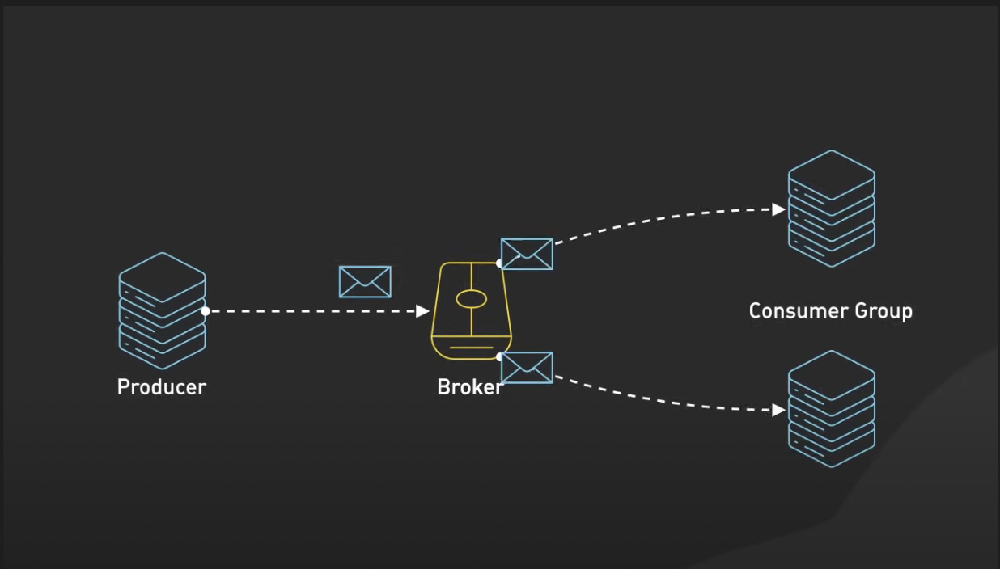

## What is a message?
Every piece of data that Kafka handle is a message.
A Kafka message is three part:
- Headers ( metadata , topics & partitions )
- Key
- Value
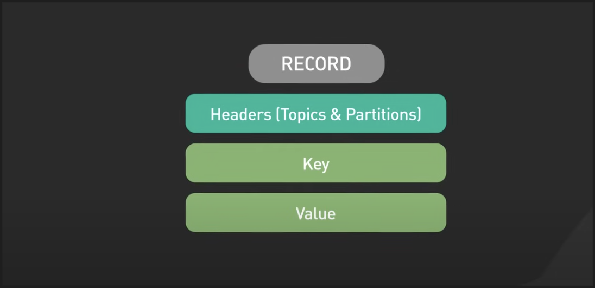

## How Kafka organise this messages with Topic & Partitions?
Messages aren't not just put in into Kafka but are organised by topics, this helps structure the data stream.
Then each topic in Kafka is divided by partition, this is the key for Kafka scalability, why? Because it allow Kafka to process the messages in parallel across multiple consumers, to achieve high throughput.
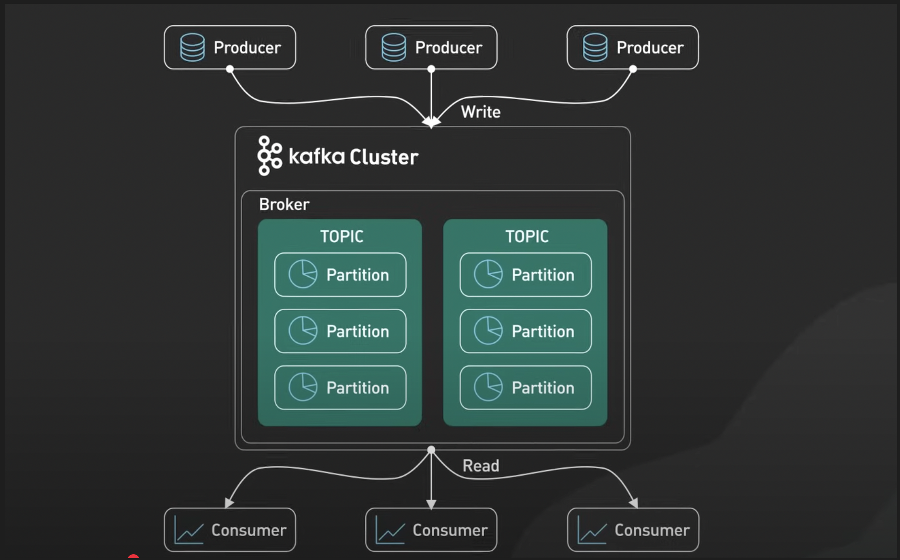

## Why Kafka is so powerful?
Kafka is great at handling multiple producers sending data simultaneously without performance degradation.
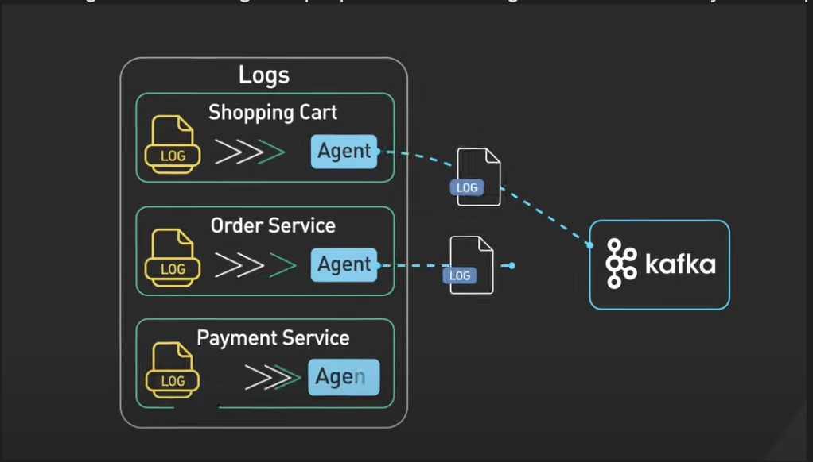
Kafka also handle multiple consumers efficiently by allowing different consumer group to read from the same topic independently.
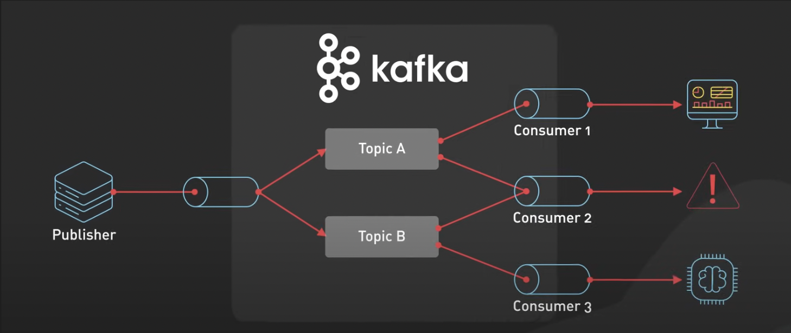
Kafka was been consumed using consumer offset store within Kafka itself, this ensures that consumers can resume processing from where they left off in case of failure.
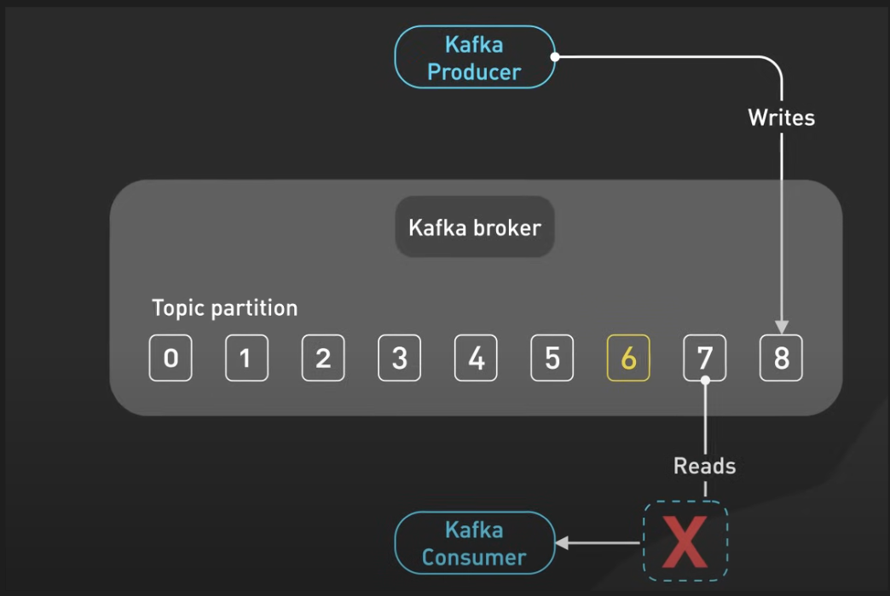
Kafka provides this spaced retention policies that allow us to store messages even after they've been consumed based on time or size limits we define, nothing is lost unless we decide it's time to clear it.
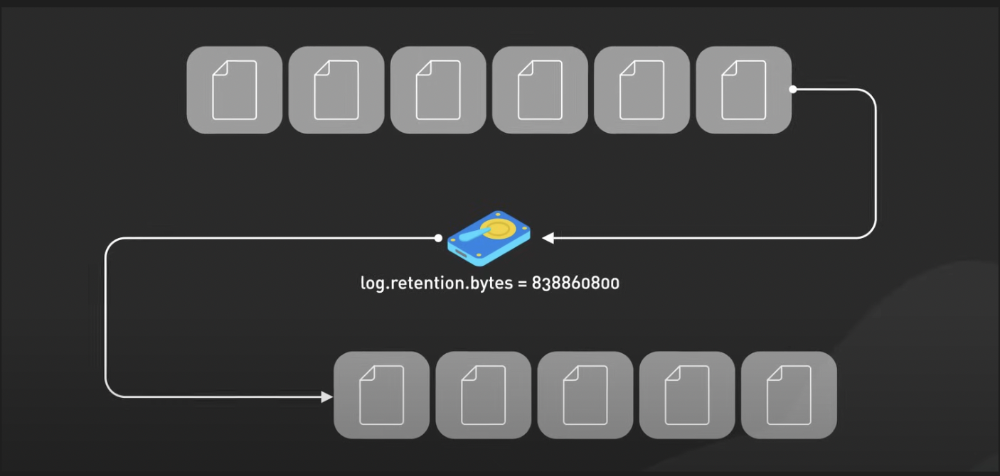
Kafka scalability means we can start small and grow as the need expands.

## Kafka Producers
Producers batch messages together to cut down on network traffic.
They use partitioners to determine which partition a message should go to, if no key is provided messages are distributed randomly across partitions.
If key is present messages with the same key are sent to the same partition for better distribution.
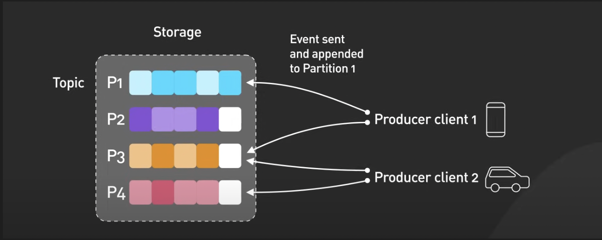

## Kafka Consumers ( who receive ) 
For consumers we have consumers and consumers groups.
Consumers groups share responsibility for processing messages from different partitions in parallel, each partition is assigned to only one consumer within a group at any given time, if one consumers fails another automatically takes over its workload to ensure uninterrupted processing.
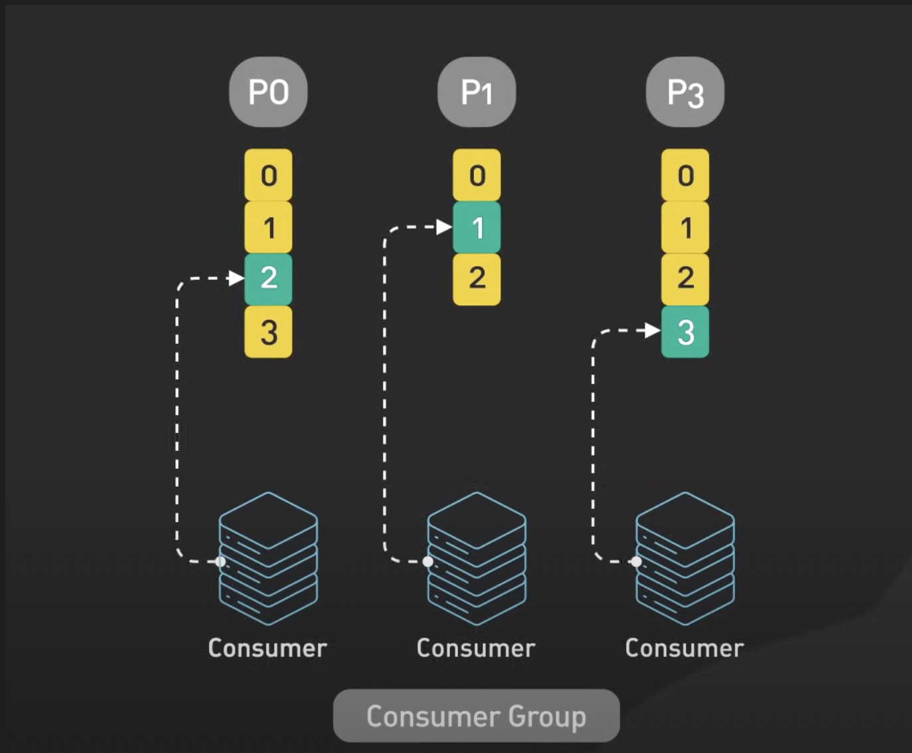
Consumers in a group divide up partitions among themselves through coordination by Kafka group coordinator, when a consumer join or leaves the group, Kafka triggers a rebalance to redistribute partitions among the remaining consumers.
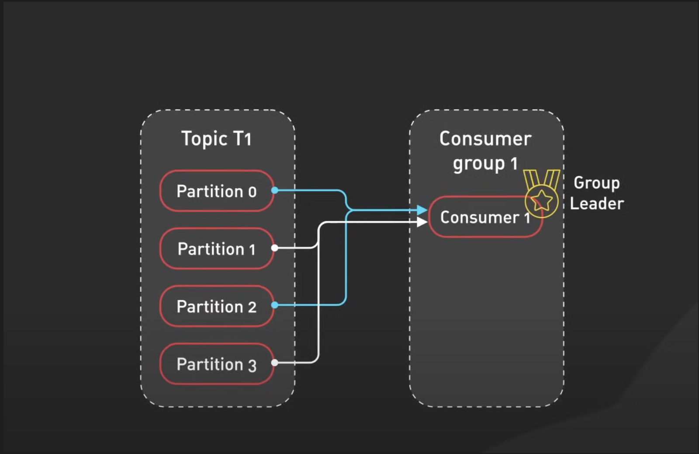

## Kafka Cluster
Kafka cluster itself is made up by multiple Brokers these are servers that store and manage our data to keep our data safe each partition is replicated across several brokers using a leader follower model, if one brokers fails another steps in as a new leader without losing any data.
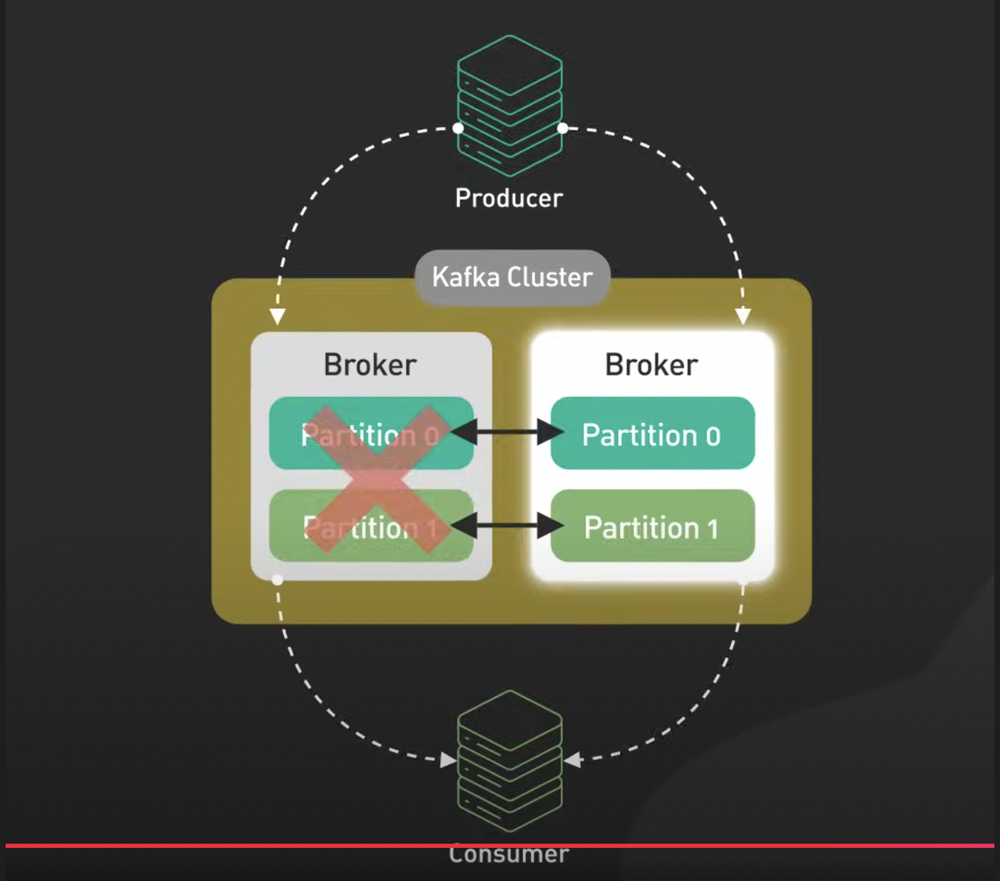
In earlier versions kafkaesque rely on ZooKeeper to manager broker metadata and leader election however newer version are using KRaft a building consensus mechanism that simplify operations by eliminating ZooKeeper as an external dependency while improving scalability.
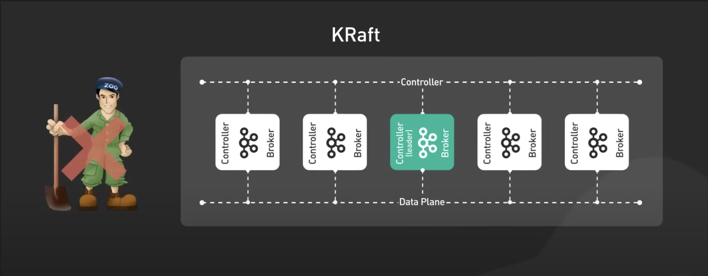
